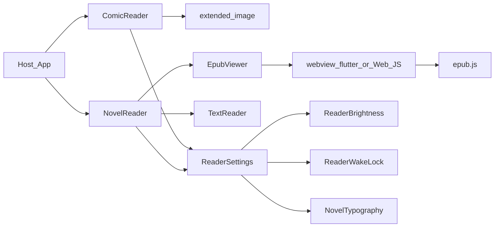

# 架构与平台矩阵

## 推荐包结构

```
my_reader_plugin/
├── pubspec.yaml
├── lib/
│   ├── my_reader_plugin.dart          # 对外 export
│   └── src/
│       ├── comic/
│       │   ├── comic_reader.dart
│       │   ├── comic_pages.dart
│       │   └── comic_reading_mode.dart
│       ├── novel/
│       │   ├── novel_reader.dart
│       │   ├── novel_source.dart
│       │   ├── epub/
│       │   │   ├── epub_viewer.dart
│       │   │   ├── epub_bridge.dart    # Dart ↔ JS
│       │   │   └── epub_shell.html
│       │   └── text/
│       │       ├── text_reader.dart
│       │       └── text_decoder.dart
│       └── common/
│           ├── reader_settings.dart
│           ├── reader_brightness.dart
│           ├── reader_wake_lock.dart
│           └── novel_typography.dart
├── assets/
│   └── epubjs/
│       ├── epub.min.js
│       ├── jszip.min.js
│       └── reader.html                # HTML shell
└── example/
```

新建包：

```bash
flutter create --template=package my_reader_plugin
```

（纯 Dart UI + 依赖插件即可，不要为阅读器再包一层 MethodChannel / `plugin_platform_interface`。）

对外只导出：`ComicReader`、`NovelReader`、`ReaderSettings`、`NovelTypography`、页源/书源类型。内部路径不进 public API。

## 依赖锁定

在插件 `pubspec.yaml` 中固定：

```yaml
dependencies:
  flutter:
    sdk: flutter
  extended_image: 10.1.0
  webview_flutter: 4.14.1
  screen_brightness: 2.1.11
  wakelock_plus: 1.7.0
  charset_converter: 2.5.1

flutter:
  assets:
    - assets/epubjs/
```

版本以本表为准；升级需同步改本 skill 与 changelog，禁止静默换主依赖。

## 模块职责

| 模块 | 职责 |
|------|------|
| `comic/` | 图片页列表、翻页模式、缩放与预加载 |
| `novel/epub/` | WebView + epub.js、CFI、目录、主题/字号桥 |
| `novel/text/` | txt/md/html 解码与排版阅读 |
| `common/` | 亮度、不熄屏、共享 `ReaderSettings` |

漫画与小说 UI 可各自独立 Widget；亮度与不熄屏通过 `ReaderSettings` + 生命周期 mixin/wrapper 统一接入，避免两套逻辑。

## 平台矩阵

| 能力 | Android | iOS | Web | macOS | Windows | Linux |
|------|---------|-----|-----|-------|---------|-------|
| 漫画 (`extended_image`) | 是 | 是 | 是 | 是 | 是 | 是 |
| 文本小说 | 是 | 是 | 是 | 是 | 是 | 是 |
| EPUB (WebView + epub.js) | 是 | 是 | 是（见下） | 是 | 是 | 是* |
| 系统亮度 | 是 | 是 | 否→遮罩 | 部分→失败则遮罩 | 部分→失败则遮罩 | 否→遮罩 |
| 不熄屏 | 是 | 是 | 受限 | 是 | 是 | 视 `wakelock_plus` |

### EPUB 平台说明

- **Android / iOS**：`WebViewWidget` + `WebViewController.loadFlutterAsset('assets/epubjs/reader.html')`；大文件可用临时 `file://` 或 `loadHtmlString` + base64。
- **macOS / Windows / Linux**：通过 `webview_flutter` 官方平台实现（如 `webview_flutter_wkwebview` / `webview_flutter_android` 及桌面配套）；不可用时对外抛明确 `UnsupportedError` 或降级为「仅支持文本小说 + 漫画」，并在 README/`Platform.isLinux` 等分支写清，禁止空 Widget。
- **Web**：不用移动端 WebView 插件路径；用同源 iframe 或 `dart:js_interop` 加载同一套 `reader.html` + epub.js，对外 `EpubBridge` API 保持一致。

### 亮度与不熄屏降级

- 系统亮度 `setScreenBrightness` 抛错或平台不支持 → 切换 `BrightnessMode.overlay`（半透明黑遮罩）。
- Web 不熄屏：调用 `wakelock_plus`；若无效则忽略并 log，不阻塞阅读。

## 数据流（简图）



## 检查清单（新建/改架构时）

- [ ] `lib/` 目录符合上文结构
- [ ] `extended_image` 精确为 `10.1.0`
- [ ] `assets/epubjs/` 含离线 JS，无 CDN
- [ ] 六端平台声明齐全；Linux EPUB 有明确策略
- [ ] `ReaderSettings` 为漫画/小说唯一设置入口
