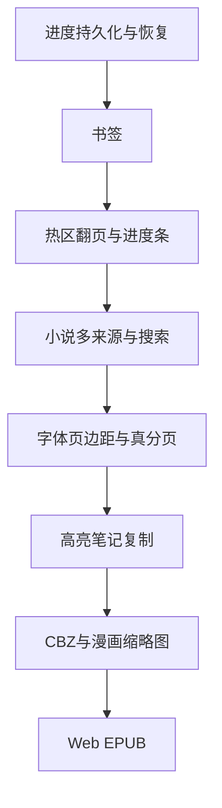

# 漫画/小说阅读器功能缺口清单

## 已有能力（对照基线）

漫画：竖/横翻、RTL、手势缩放、邻页预加载、页源 files/urls/bytes、亮度、不熄屏、页码工具栏。

小说：EPUB（epub.js）+ txt/md/html、竖滚/横翻、目录选章、主题色、字号/行距、亮度、不熄屏、CFI 回调、文本编码探测。

以下为**缺失**功能点。

---

## P0 — 主流阅读器标配（别人几乎都有）

### 共用 / 进度与状态

1. **阅读进度持久化**：按书本 ID 自动保存/恢复进度（漫画页码；小说 CFI / 章节+偏移）；包内提供 `ReaderProgressStore` 或明确持久化 API
2. **进度条 / 进度百分比**：工具栏隐藏时顶部细进度条；可拖动跳转
3. **书签**：添加/删除/列表跳转（漫画按页；小说按 CFI 或段落索引）
4. **左右点击热区翻页**：左 1/3 上一页、右 1/3 下一页、中部唤出工具栏（漫画 + 小说横翻）
5. **上一章 / 下一章**：工具栏按钮 + API（`onChapterChanged`）
6. **沉浸式 UI**：读中隐藏状态栏/导航栏，退出恢复
7. **设置与主题持久化**：字号、行距、主题、方向、亮度偏好自动记住

### 小说

8. **全文搜索**：关键词搜索，结果列表跳转到 CFI/段落
9. **字体族选择器**：工具栏可选内置/系统字体（API 已有 `fontFamily`，UI 未接）
10. **页边距 / 字间距**：`margin`、`letterSpacing` 调节
11. **对齐方式**：左对齐 / 两端对齐
12. **真正的文本分页**：横翻按视口高度测量分页（当前按段落一页，体验弱于竞品）
13. **EPUB `next`/`prev` UI**：桥已有方法，工具栏无翻页按钮
14. **多来源加载**：`fromAsset` / `fromUrl` / `fromBytes`（当前小说仅本地 `path`）

### 漫画

15. **双页模式**（平板横屏左右两页）
16. **点击热区翻页**（同上第 4 点，漫画侧也缺独立热区，目前主要靠滑动）
17. **页码跳转**：输入页码或滑块快速定位
18. **裁边 / 适应模式**：`BoxFit.contain` 外再提供 width-fit / height-fit

---

## P1 — 竞品常见增强

### 小说

19. **划线高亮**：选区高亮，多色，持久化
20. **笔记 / 批注**：绑定高亮或 CFI 的文字笔记
21. **复制选中文本**：EPUB/文本长按复制
22. **TTS 朗读**：系统 TTS，语速/语音，位置跟随
23. **自动滚屏**：可调速度的自动滚动
24. **EPUB 内图片点击放大**
25. **RTL 语言文字方向**（阿语/希伯来语等）
26. **断字 / 更好的 Markdown 渲染**（当前 md/html 仅剥离标记）
27. **Web 完整 EPUB**：iframe / `dart:js_interop` 同源 shell（当前 Web 直接报错）

### 漫画

28. **CBZ / CBR / ZIP 整包解析**：解压后按页阅读（竞品 flureadium 等有 CBZ）
29. **长图条漫连续模式优化**：页间缝隙、预加载窗口可配置
30. **缩略图页导航**：网格选页
31. **双指缩放后双击复位**
32. **屏幕常亮 + 音量键翻页**（Android 常见）

### 共用

33. **手势自定义**：是否启用热区、滑动灵敏度
34. **多语言 UI 字符串**（工具栏「选择章节」等）
35. **阅读会话统计**：时长、字数/页数回调（便于宿主同步）

---

## P2 — 高级 / 「没有的也要有」扩展

36. **PDF 阅读**（部分竞品有；超出当前 skill 漫画+小说范围，可另模块）
37. **有声书 / Media Overlay**
38. **同步高亮（karaoke 跟读）**
39. **云同步回调**：书签/高亮/进度 `onSync` 钩子
40. **截屏/录屏防护（DRM 向）**
41. **仿真翻页动画**（3D page curl）
42. **水印 / 试读页数限制**
43. **批注手绘笔迹**
44. **目录无限嵌套 UI 树**（数据已支持 `children`，UI 目前扁平化）
45. **漫画背景色 / 页间底色**（黑/灰/白）
46. **导出书签/高亮为 JSON**

---

## Skill / 架构已写但未落地或半落地

| Skill 约定 | 现状 |
|------------|------|
| EPUB Web JS interop | 未实现 |
| Linux EPUB fallback 明确策略 | 依赖 webview，失败体验弱 |
| `getLocation` 桥方法 | JS 有，Dart 未封装给宿主 |
| `EpubViewerController` | 未从包根 export |
| 字体族工具栏 | API 有、UI 无 |

---

## 建议落地顺序（确认后实施）

**本回合交付物**：以上缺口清单（不改代码）。确认优先级后，可按 P0 → P1 分批实现。
